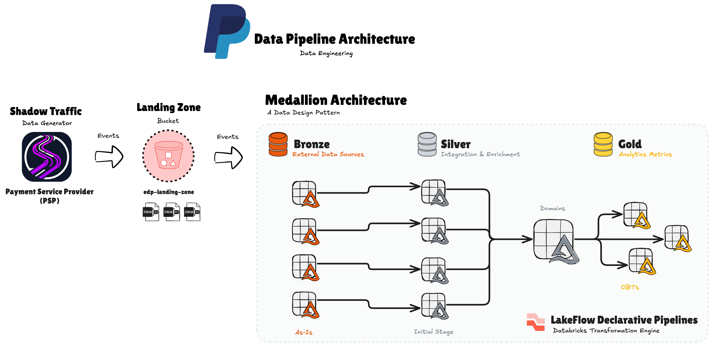
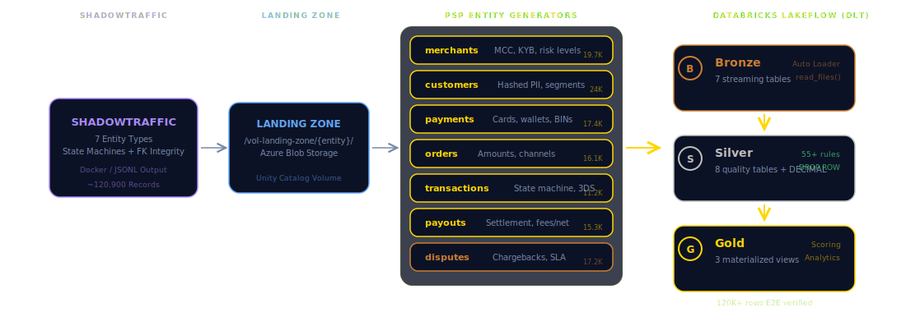
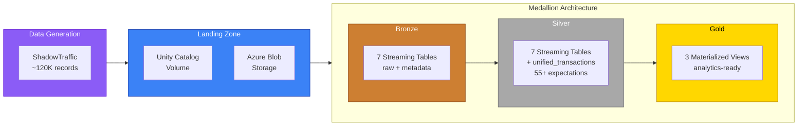
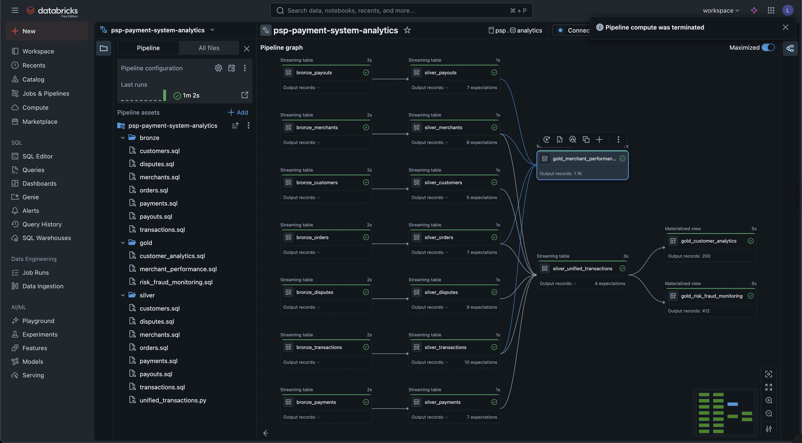
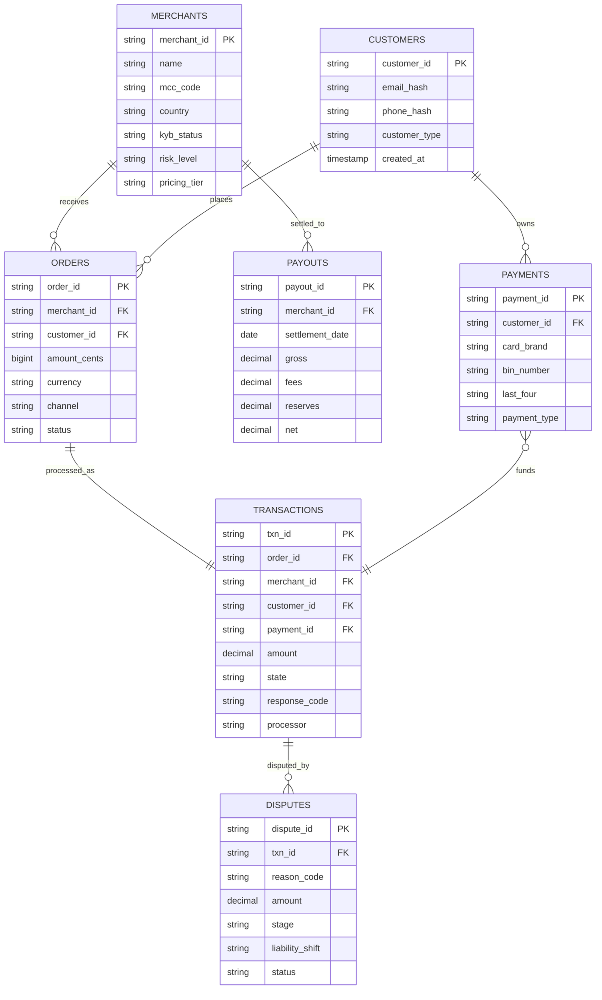
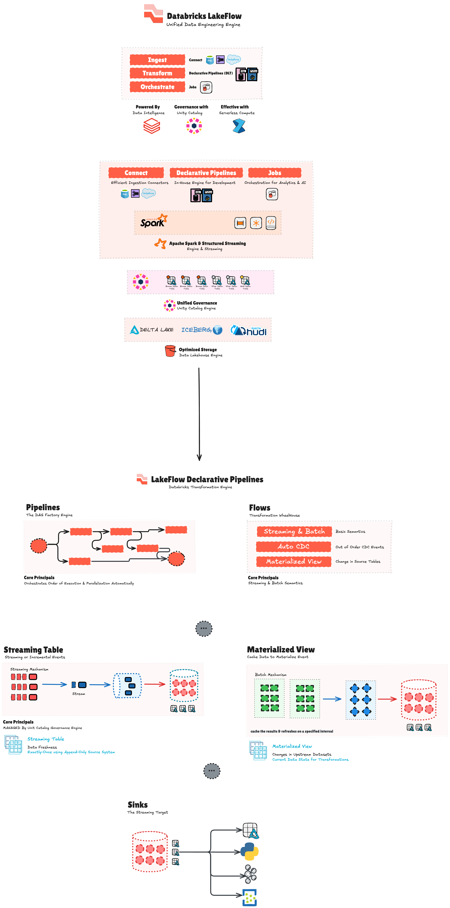

<div align="center">

# PSP Payment System — Lakeflow Declarative Pipelines

**Production-grade Medallion Architecture for Payment Service Providers on Databricks**

[](https://www.databricks.com/)
[](https://delta.io/)
[](https://azure.microsoft.com/)
[]()
[]()

*A complete reference implementation modeling the data lifecycle of a Payment Service Provider (like Stripe, Adyen, or Square) — from synthetic data generation through Bronze, Silver, and Gold analytics layers.*

---

**18 DLT Notebooks** · **55+ Data Quality Rules** · **120K+ Synthetic Records** · **3 Gold Analytics Views**

</div>

---

## Architecture Overview

<div align="center">
  
</div>

The system implements a complete **Medallion Architecture** using **Databricks Lakeflow Declarative Pipelines (DLT)** with serverless Photon compute. Data flows from synthetic generation through three refinement layers, each adding quality, structure, and business value.

### End-to-End Pipeline Diagram

<div align="center">
  
</div>

### Data Flow



---

## Tech Stack

| Layer | Technology | Purpose |
|-------|-----------|---------|
| **Cloud Platform** | Azure Databricks | Unified data analytics workspace |
| **Pipeline Engine** | Lakeflow Declarative Pipelines (DLT) | Declarative ETL with built-in quality |
| **Query Engine** | Photon (Serverless) | Native C++ vectorized execution |
| **Table Format** | Delta Lake | ACID transactions, time travel, Z-Order |
| **Governance** | Unity Catalog | Catalog/Schema/Volume management |
| **Deployment** | Databricks Asset Bundles (DABs) | Infrastructure-as-Code pipeline deployment |
| **IaC** | Terraform (Databricks Provider v1.109.0) | Cloud resource provisioning |
| **Data Generation** | ShadowTraffic (Docker) | Realistic synthetic data with state machines |
| **Languages** | SQL (17 notebooks) + Python (1 notebook) | Pipeline definitions |
| **CI/CD** | Azure DevOps | Automated deployment pipelines |

---

## Pipeline in Databricks

<div align="center">
  
  <br>
  <em>The DLT pipeline graph showing all 18 notebooks and their dependency resolution</em>
</div>

---

## Data Model

The PSP domain model consists of **7 interconnected entities** that represent the full payment lifecycle:



---

## Medallion Architecture Deep Dive

### Bronze Layer — Raw Ingestion

> **7 Streaming Tables** | Schema-on-read | Full lineage tracking

Every Bronze table follows the same pattern — `STREAM read_files()` with Auto Loader for incremental JSON ingestion:

```sql
CREATE OR REFRESH STREAMING TABLE `psp`.bronze.psp_merchants
COMMENT 'Raw merchant data ingested from landing zone'
TBLPROPERTIES ('quality' = 'bronze', 'domain' = 'merchants')
AS SELECT
    *,
    current_timestamp() AS _ingested_at,
    _metadata.file_path AS _source_file,
    _metadata.file_name AS _source_file_name
FROM STREAM read_files(
    '/Volumes/psp/analytics/vol-landing-zone/merchants/',
    format => 'json',
    schemaEvolutionMode => 'addNewColumns'
);
```

| Table | Source System | ~Records | Key Fields |
|-------|-------------|----------|------------|
| `psp_merchants` | psp_onboarding | 19,700 | MCC, KYB status, risk level |
| `psp_customers` | psp_gateway | 24,000 | Hashed PII, customer type |
| `psp_payment_instruments` | psp_gateway | 17,400 | Tokenized cards, wallets |
| `psp_orders` | psp_gateway | 16,100 | Amounts in cents, channels |
| `psp_transactions` | psp_gateway | 11,200 | State machine, response codes |
| `psp_payouts` | psp_funding | 15,300 | Settlement batches, net amounts |
| `psp_disputes` | psp_disputes | 17,200 | Chargebacks, reason codes |

---

### Silver Layer — Cleansed & Enriched

> **8 Streaming Tables** | 55+ DLT Expectations | Business-ready derivations

Each Silver table applies **DLT Expectations** for data quality enforcement, performs type casting, normalization, and derives business-meaningful columns:

```sql
-- Example: Silver transactions with 10 data quality expectations
CONSTRAINT valid_txn_id EXPECT (txn_id IS NOT NULL) ON VIOLATION DROP ROW
CONSTRAINT valid_amount EXPECT (amount > 0) ON VIOLATION DROP ROW
CONSTRAINT valid_currency EXPECT (currency IN ('USD','EUR','GBP','CAD','AUD')) ON VIOLATION DROP ROW
CONSTRAINT valid_state EXPECT (state IN ('authorized','captured','settled','declined','voided','refunded')) ON VIOLATION DROP ROW
```

#### Data Quality Rules by Entity

| Entity | Expectations | Key Validations |
|--------|:-----------:|-----------------|
| **Merchants** | 8 | ID, MCC format (regex), country enum, KYB/pricing/risk status |
| **Customers** | 5 | ID, hash format validation (SHA-256 regex), type enum |
| **Payments** | 7 | Card brand enum, BIN/last4 format, expiry range |
| **Orders** | 8 | Currency, amount > 0, sum validation (subtotal + tax + tip = total), channel |
| **Transactions** | 10 | Amount, currency, state machine, response codes, processor, 3DS |
| **Payouts** | 8 | Date, currency, gross > 0, net = gross - fees - reserves, status |
| **Disputes** | 9 | Reason code, amount, stage enum, temporal logic (closed >= opened) |

#### Silver L2: Unified Transactions (Python)

The `unified_transactions` table is written in **Python** because DLT SQL cannot express multi-way streaming joins with mixed join types:

```python
@dlt.table(
    name="silver_unified_transactions",
    comment="Unified transaction view joining all Silver L1 tables",
    table_properties={"pipelines.autoOptimize.zOrderCols": "txn_id,transaction_date,merchant_id,customer_id"}
)
def unified_transactions():
    # 6-way join: transactions INNER orders INNER merchants INNER customers INNER payments LEFT disputes
    transactions = dlt.read_stream("psp_transactions")
    orders = dlt.read_stream("psp_orders")
    merchants = dlt.read_stream("psp_merchants")
    customers = dlt.read_stream("psp_customers")
    payments = dlt.read_stream("psp_payment_instruments")
    disputes = dlt.read("psp_disputes")  # batch — infrequent updates
    # ... produces 80+ columns at transaction grain
```

#### Key Silver Derivations

| Entity | Derived Columns |
|--------|----------------|
| **Merchants** | `mcc_category`, `is_high_risk`, `is_enterprise`, risk level flags |
| **Customers** | `customer_tenure_days`, `is_vip_customer`, `is_flagged_customer` |
| **Payments** | `card_network_tier`, `is_expired`, `is_wallet_payment`, masked card display |
| **Orders** | Dollar amounts from cents, `tax_rate`, `tip_rate`, `order_size_category` |
| **Transactions** | State categories, response code decoding, `fee_rate`, `net_amount` |
| **Payouts** | `fee_rate`, `reserve_rate`, `net_margin_rate`, `settlement_delay_days` |
| **Disputes** | `dispute_category`, `stage_severity_level`, `dispute_age_days`, `sla_status` |

---

### Gold Layer — Business Analytics

> **3 Materialized Views** | Composite scoring models | Actionable insights

#### 1. Merchant Performance (`psp_merchant_performance`)

**Grain:** `merchant_id` + `transaction_date`

| Metric Category | Examples |
|----------------|---------|
| Volume | Transaction count, success/decline rates |
| Revenue | Gross revenue, net revenue, total fees |
| Channels | POS vs online vs mobile distribution |
| Authentication | 3DS authentication rates |
| Payouts | Settlement reconciliation, delay days |
| **Derived** | `performance_rating` (excellent/good/fair/poor), `revenue_tier` |

#### 2. Customer Analytics (`psp_customer_analytics`)

**Grain:** `customer_id` (lifetime)

| Metric Category | Examples |
|----------------|---------|
| Lifetime Value | Total transactions, gross/net spend |
| Behavior | Unique merchants, payment methods, channel preferences |
| Recency | `transactions_last_30d`, `spend_last_90d` |
| **Segments** | `value_segment` (whale/high/medium/low), `lifecycle_stage` (active/at_risk/churned) |
| **Scoring** | `customer_health_score` (0-100, weighted composite) |

Health score weights: success rate (30%) + frequency (20%) + recency (30%) + volume (20%)

#### 3. Risk & Fraud Monitoring (`psp_risk_fraud_monitoring`)

**Grain:** `txn_id` (per transaction)

| Component | Score Range | Factors |
|-----------|-----------|---------|
| Merchant Risk | 0–40 | Risk level, high-risk MCC, KYB status |
| Customer Risk | -10–30 | Flagged status, tenure, new customer |
| Transaction Pattern | 0–50 | High value, no auth, late night, new card |
| **Total Risk** | 0–100 | `risk_classification`: critical/high/medium/low |

**7 Fraud Indicators:** confirmed_fraud, suspected_fraud, flagged_customer_decline, high_value_no_auth, new_card_high_value, new_customer_high_value, late_night_high_value

**Recommended Actions:** `block_merchant` | `manual_review` | `enhanced_monitoring` | `monitor` | `normal`

---

## Lakeflow Concepts

<div align="center">
  
  <br>
  <em>Streaming Tables, Materialized Views, and pipeline concepts in Lakeflow DLT</em>
</div>

---

## Project Structure

```
psp-payment-system-lakeflow/
│
├── pipelines/                          # Databricks Asset Bundles (DABs)
│   ├── databricks.yml                  # Bundle config (variables, dev/prd targets)
│   ├── resources/
│   │   ├── psp_analytics_pipeline.yml  # Pipeline: 18 notebooks, serverless, Photon
│   │   └── psp_orchestration_job.yml   # Daily refresh job (06:00 UTC, paused)
│   └── src/psp-analytics/
│       ├── bronze/                     # 7 SQL streaming tables (raw ingestion)
│       │   ├── merchants.sql
│       │   ├── customers.sql
│       │   ├── payments.sql
│       │   ├── orders.sql
│       │   ├── transactions.sql
│       │   ├── payouts.sql
│       │   └── disputes.sql
│       ├── silver/                     # 7 SQL + 1 Python streaming tables
│       │   ├── merchants.sql
│       │   ├── customers.sql
│       │   ├── payments.sql
│       │   ├── orders.sql
│       │   ├── transactions.sql
│       │   ├── payouts.sql
│       │   ├── disputes.sql
│       │   └── unified_transactions.py # 6-way join (Python)
│       └── gold/                       # 3 materialized views
│           ├── merchant_performance.sql
│           ├── customer_analytics.sql
│           └── risk_fraud_monitoring.sql
│
├── gen/                                # ShadowTraffic data generator
│   ├── psp.json                        # Full generator config (7 entities)
│   └── readme.md                       # Generator documentation
│
├── data/                               # Pre-generated synthetic JSONL
│   ├── merchants.jsonl                 # 19,700 records
│   ├── customers.jsonl                 # 24,000 records
│   ├── payments.jsonl                  # 17,400 records
│   ├── orders.jsonl                    # 16,100 records
│   ├── transactions.jsonl              # 11,200 records
│   ├── payouts.jsonl                   # 15,300 records
│   └── disputes.jsonl                  # 17,200 records
│
├── configs/                            # Environment configuration templates
│   ├── .envrc.example                  # Azure DevOps / CI variables
│   ├── azure-env.sh.example            # Azure subscription, storage, UC config
│   └── databricks-env.sh.example       # Workspace, catalog, pipeline settings
│
├── cli/                                # FlowCheck debugging CLI (Typer + Rich)
│   ├── app.py                          # 5 commands: trace, status, inspect, logs, profile
│   ├── config.py                       # Configuration dataclass
│   ├── commands/                       # Command implementations
│   ├── services/                       # S3, Lambda, Databricks, Parquet services
│   └── display/                        # Rich terminal output formatting
│
├── docs/                               # Reference documentation
│   └── psp-use-case.pdf                # PSP domain reference (7 pages)
│
└── images/                             # Architecture diagrams
    ├── data-pipeline.png               # End-to-end pipeline architecture
    ├── pipeline.png                    # Databricks pipeline graph
    └── lakeflow.png                    # Lakeflow concepts reference
```

---

## Getting Started

### Prerequisites

- [Databricks CLI](https://docs.databricks.com/dev-tools/cli/index.html) >= 0.283.0
- [Databricks Workspace](https://www.databricks.com/) with Unity Catalog enabled
- Azure subscription with Blob Storage
- [Docker](https://www.docker.com/) (for ShadowTraffic data generation)

### 1. Clone the Repository

```bash
git clone https://github.com/<your-org>/dbx-lakeflow-psp-payment-system.git
cd dbx-lakeflow-psp-payment-system
```

### 2. Configure Environment

```bash
# Copy and fill in your Azure + Databricks settings
cp configs/azure-env.sh.example configs/azure-env.sh
cp configs/databricks-env.sh.example configs/databricks-env.sh

# Edit with your values
vim configs/databricks-env.sh
```

Key variables to configure:

| Variable | Description | Default |
|----------|------------|---------|
| `DATABRICKS_HOST` | Workspace URL | — |
| `DATABRICKS_TOKEN` | PAT or OAuth token | — |
| `CATALOG` | Unity Catalog catalog name | `psp` |
| `LANDING_VOLUME` | Volume path for raw data | `/Volumes/psp/analytics/vol-landing-zone` |

### 3. Generate Synthetic Data

```bash
# Using pre-generated data (already in /data/)
# OR generate fresh data with ShadowTraffic:
cd gen
docker run --env-file key.env -v $(pwd)/psp.json:/home/config.json \
  shadowtraffic/shadowtraffic:latest --config /home/config.json
```

See [gen/readme.md](gen/readme.md) for detailed data generation documentation.

### 4. Upload Data to Landing Zone

```bash
# Upload JSONL files to Unity Catalog Volume
databricks fs cp data/merchants.jsonl /Volumes/psp/analytics/vol-landing-zone/merchants/
databricks fs cp data/customers.jsonl /Volumes/psp/analytics/vol-landing-zone/customers/
# ... repeat for all 7 entities
```

### 5. Deploy the Pipeline

```bash
cd pipelines

# Validate the bundle
databricks bundle validate -t dev

# Deploy to development
databricks bundle deploy -t dev

# Run the pipeline
databricks bundle run psp-payment-system-analytics -t dev
```

---

## Deployment

### Databricks Asset Bundles (DABs)

The project uses DABs for infrastructure-as-code pipeline deployment with two pre-configured targets:

| Target | Catalog | Mode | Compute | Permissions |
|--------|---------|------|---------|-------------|
| **dev** | `psp` | development | Personal / Serverless | Developer |
| **prd** | `psp_prd` | production | Service Principal | RBAC (view/run/manage) |

### Pipeline Configuration

```yaml
# pipelines/resources/psp_analytics_pipeline.yml
serverless: true          # No cluster management
photon: true              # Native C++ vectorized engine
edition: ADVANCED         # Full DLT features (expectations)
continuous: false          # Triggered/scheduled runs
channel: CURRENT          # Latest DLT runtime
```

### Orchestration

```yaml
# pipelines/resources/psp_orchestration_job.yml
schedule:
  quartz_cron_expression: "0 0 6 * * ?"  # Daily at 06:00 UTC
  pause_status: PAUSED                     # Safe default
```

### Production Deployment

```bash
# Deploy to production (requires service principal auth)
databricks bundle deploy -t prd

# Unpause the daily schedule
databricks bundle run psp-payment-system-orchestration -t prd
```

---

## Synthetic Data Generation

The project uses **ShadowTraffic** to generate production-realistic PSP data with:

| Feature | Detail |
|---------|--------|
| **Referential integrity** | FK lookups across all 7 entities |
| **Weighted distributions** | 92% auth success, 8% decline, 2% dispute rate |
| **State machines** | Transaction lifecycle (authorized → captured → settled) |
| **Realistic patterns** | Late-arriving disputes (7-60 days), intentional orphans (~1%) |
| **Privacy compliance** | Pre-hashed PII (SHA-256), tokenized card numbers |
| **Fee calculations** | Mathematically consistent gross/fees/reserves/net |

### Entity Volumes

| Entity | Records | Size | Key Characteristics |
|--------|--------:|-----:|---------------------|
| merchants | 19,700 | 4.0 MB | MCC codes, KYB verification, risk tiers |
| customers | 24,000 | 4.0 MB | Hashed emails/phones, customer segments |
| payments | 17,400 | 4.0 MB | Card brands, BIN numbers, wallets |
| orders | 16,100 | 4.0 MB | Amounts in cents, multi-channel |
| transactions | 11,200 | 4.2 MB | Full state machine, 3DS auth |
| payouts | 15,300 | 4.2 MB | Settlement batches, fee breakdown |
| disputes | 17,200 | 4.2 MB | Chargebacks, reason codes, SLA |

---

## CLI Tool — FlowCheck

An operational debugging CLI built with **Typer** and **Rich** for tracing data through the pipeline:

| Command | Description |
|---------|------------|
| `trace <filename>` | Trace a file from S3 landing through all layers |
| `status` | Health dashboard across all file types and layers |
| `inspect s3\|parquet\|pipeline` | Inspect S3 objects, Parquet files, or pipeline state |
| `logs lambda\|pipeline` | Query CloudWatch or Lakeflow pipeline logs |
| `profile` | Cross-layer row count comparison |

```bash
# Example usage
python -m cli trace merchants_20240101.jsonl
python -m cli status
python -m cli inspect pipeline
```

---

## Key Design Decisions

| Decision | Rationale |
|----------|-----------|
| **Single unified pipeline** | All 18 notebooks in one DLT pipeline — the engine resolves dependency graphs automatically |
| **Streaming end-to-end** | `STREAMING TABLE` + `STREAM()` enables incremental processing from Bronze through Silver |
| **Materialized Views for Gold** | Gold aggregates across Silver and needs full recomputation — not incremental |
| **Python for multi-way joins** | DLT SQL cannot express mixed `INNER` + `LEFT` streaming joins — documented limitation |
| **Cents preservation** | Integer cents kept alongside `DECIMAL(18,2)` dollar amounts to avoid floating-point issues |
| **DROP ROW on violation** | Failed quality rows are dropped (not quarantined) for pipeline simplicity |
| **Z-Order optimization** | Unified transactions table optimized on `txn_id, transaction_date, merchant_id, customer_id` |
| **Paused production schedule** | Job deploys paused by default — requires explicit activation for safety |

---

## Documentation

| Resource | Description |
|----------|------------|
| [Interactive Presentation](presentation/psp-lakeflow.html) | Visual slide deck (open in browser) |
| [gen/readme.md](gen/readme.md) | ShadowTraffic data generator documentation |
| [docs/psp-use-case.pdf](docs/psp-use-case.pdf) | PSP domain reference (schemas, medallion overview) |
| [configs/](configs/) | Environment configuration templates |

---

## License

This project is provided as a reference implementation for educational and demonstration purposes.

---

<div align="center">

**Built with Databricks Lakeflow Declarative Pipelines**

*Medallion Architecture · Delta Lake · Unity Catalog · Photon Engine*

</div>
